# Zomato Clone Application Architecture:

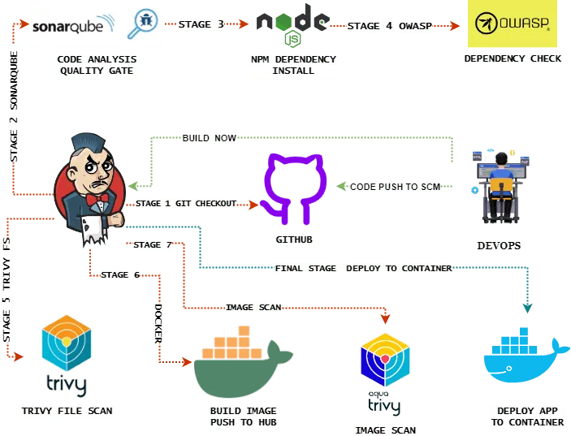

# Getting Started with Deploying the Zomato App:

Steps:-

Step 1 — Launch an Ubuntu(22.04) T2 Large Instance

Step 2 — Install Jenkins, Docker and Trivy. Create a Sonarqube Container using Docker.

Step 3 — Install Plugins like JDK, Sonarqube Scanner, Nodejs, and OWASP Dependency Check.

Step 4 — Create a Pipeline Project in Jenkins using a Declarative Pipeline

Step 5 — Install OWASP Dependency Check Plugins

Step 6 — Docker Image Build and Push

Step 7 — Deploy the image using Docker

Step 8 — Terminate the AWS EC2 Instances.

# Output:

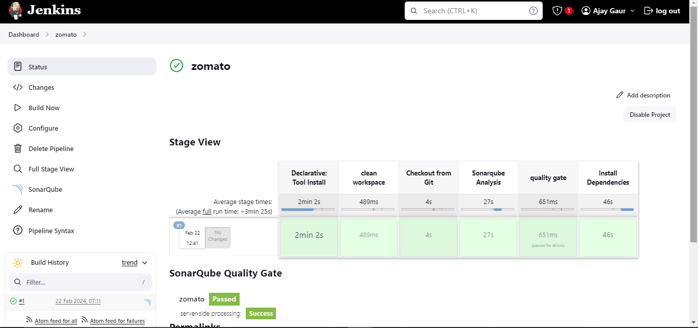

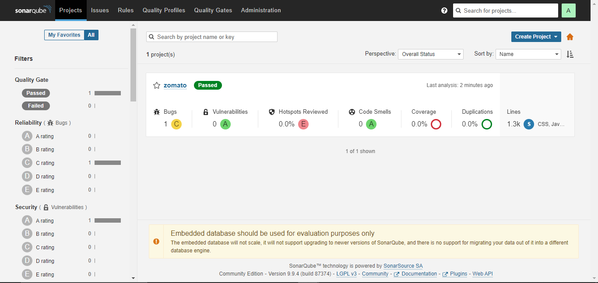

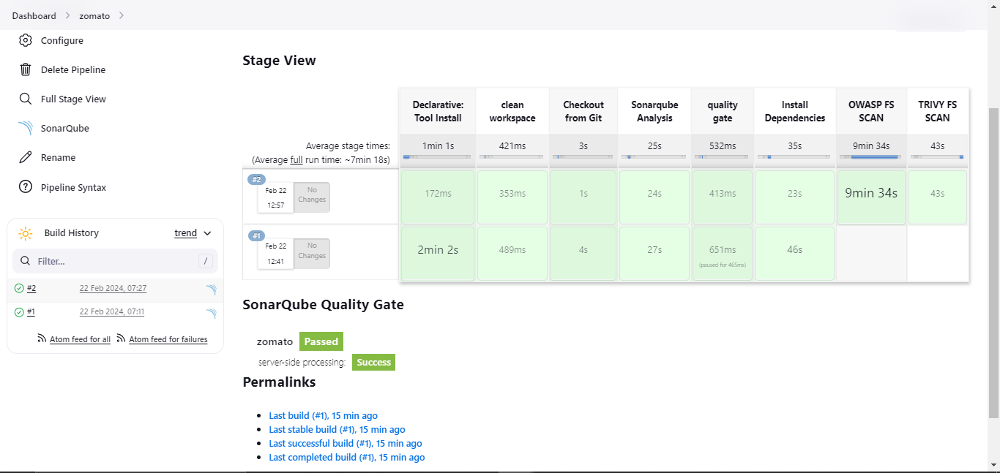

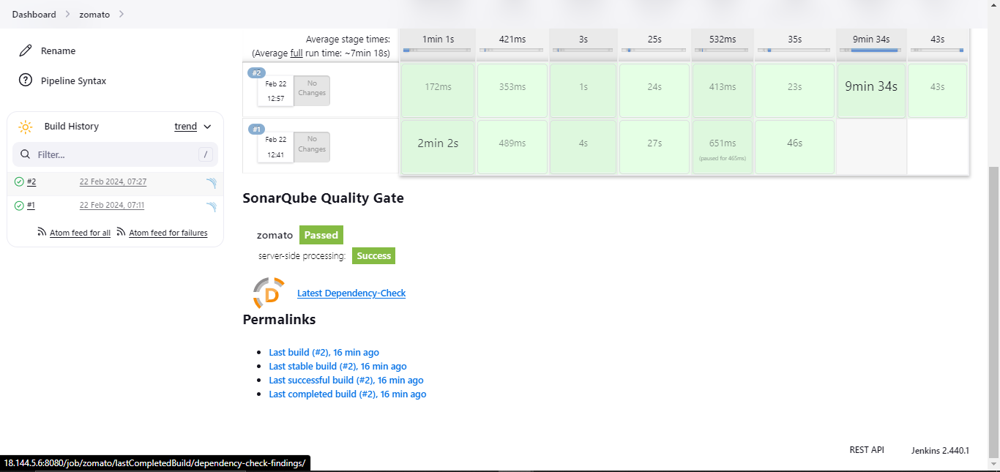

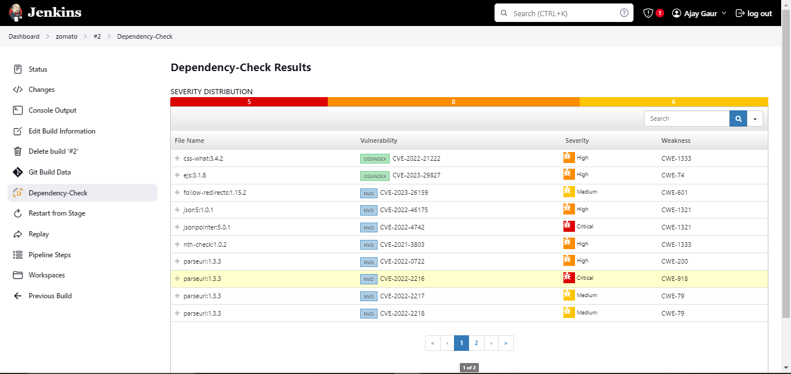


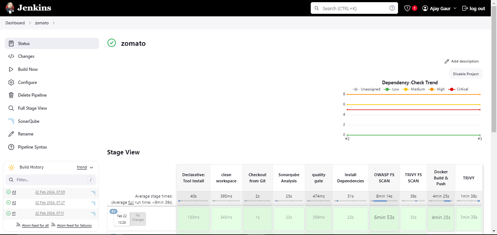

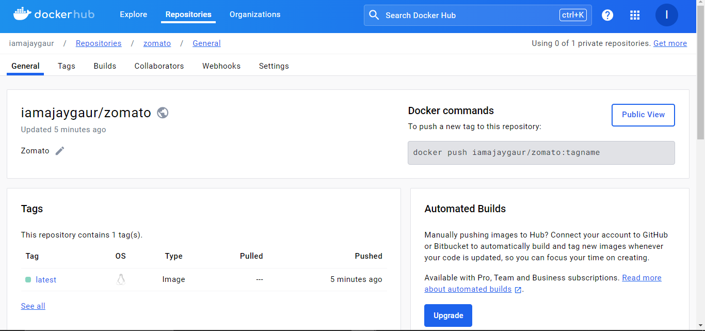


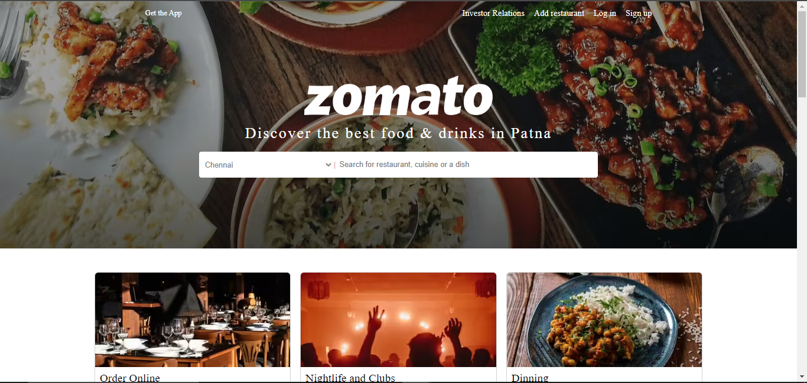

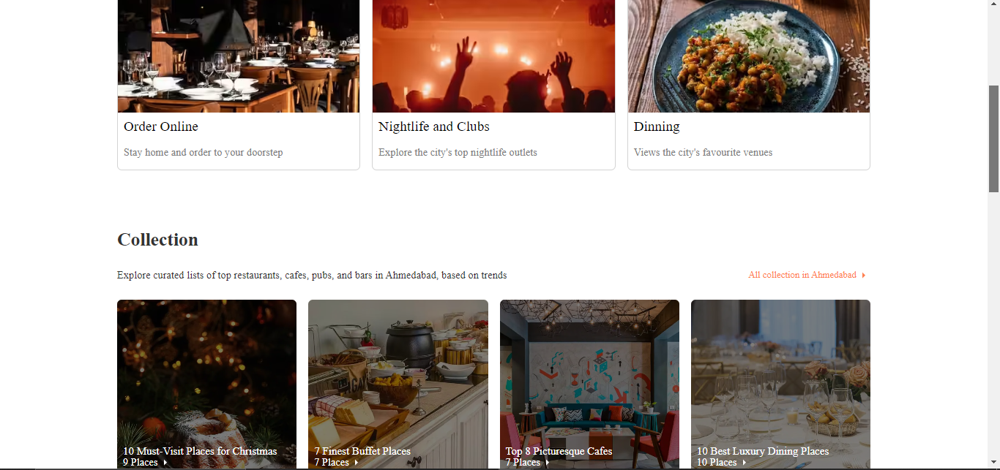

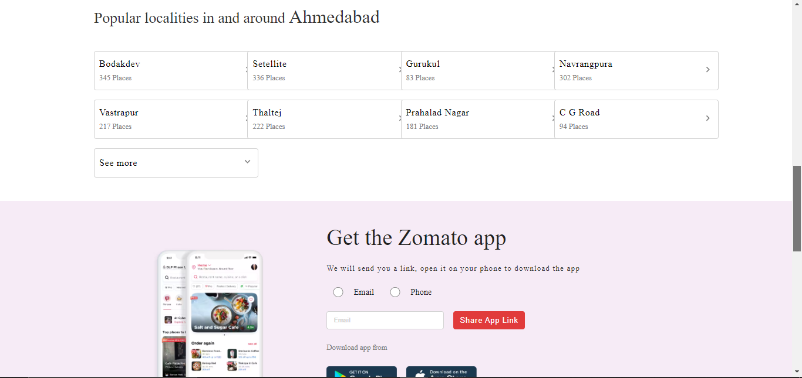

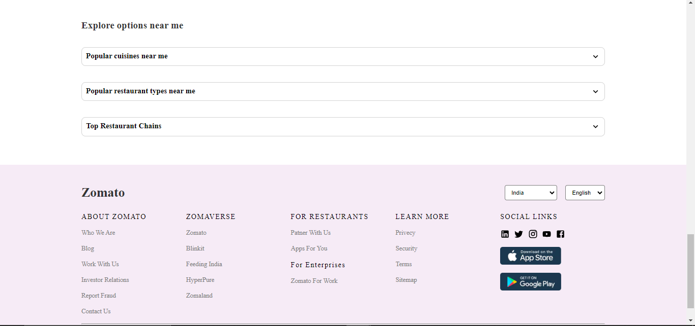


# Configure CI/CD Pipeline in Jenkins:
- Create a CI/CD pipeline in Jenkins to automate your application deployment.

```groovy
pipeline{
    agent any
    tools{
        jdk 'jdk17'
        nodejs 'node16'
    }
    environment {
        SCANNER_HOME=tool 'sonar-scanner'
    }
    stages {
        stage('clean workspace'){
            steps{
                cleanWs()
            }
        }
        stage('Checkout from Git'){
            steps{
                git branch: 'master', url: 'https://github.com/iamajaygaur/zomato-DevSecOps-CICD.git'
            }
        }
        stage("Sonarqube Analysis "){
            steps{
                withSonarQubeEnv('sonar-server') {
                    sh ''' $SCANNER_HOME/bin/sonar-scanner -Dsonar.projectName=zomato \
                    -Dsonar.projectKey=zomato '''
                }
            }
        }
        stage("quality gate"){
           steps {
                script {
                    waitForQualityGate abortPipeline: false, credentialsId: 'sonar' 
                }
            } 
        }
        stage('Install Dependencies') {
            steps {
                sh "npm install"
            }
        }
		stage('OWASP FS SCAN') {
            steps {
                dependencyCheck additionalArguments: '--scan ./ --disableYarnAudit --disableNodeAudit', odcInstallation: 'DP-Check'
                dependencyCheckPublisher pattern: '**/dependency-check-report.xml'
            }
        }
        stage('TRIVY FS SCAN') {
            steps {
                sh "trivy fs . > trivyfs.txt"
            }
        }
		stage("Docker Build & Push"){
            steps{
                script{
                   withDockerRegistry(credentialsId: 'docker', toolName: 'docker'){   
                       sh "docker build -t zomato ."
                       sh "docker tag zomato iamajaygaur/zomato:latest "
                       sh "docker push iamajaygaur/zomato:latest "
                    }
                }
            }
        }
        stage("TRIVY"){
            steps{
                sh "trivy image iamajaygaur/zomato:latest > trivy.txt" 
            }
        }
		stage('Deploy to container'){
         steps{
            sh 'docker run -d --name zomato -p 3000:3000 iamajaygaur/zomato:latest'
          }
        }
    }
}
```
